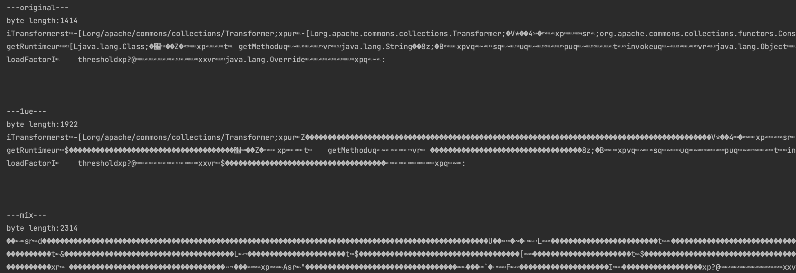
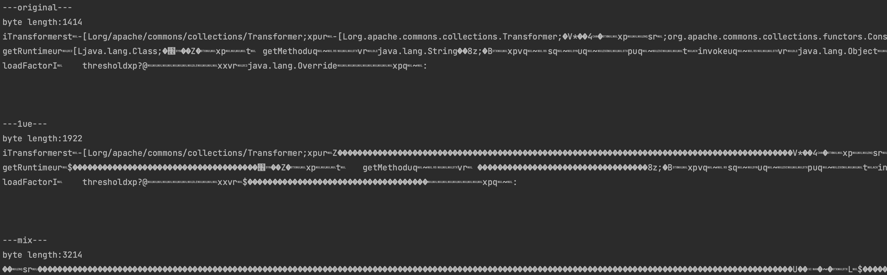

# utf-8-overlong-encoding

By. Whoopsunix

抽离出 utf-8-overlong-encoding 的序列化逻辑，直接加密序列化数组, WIKI https://whoopsunix.com/docs/PPPYSO/advance/UTFMIX/

2、3 字节的加密都已实现，修改 com.ppp.UTF8BytesMix.type 属性值更改。

2 字节

3 字节

